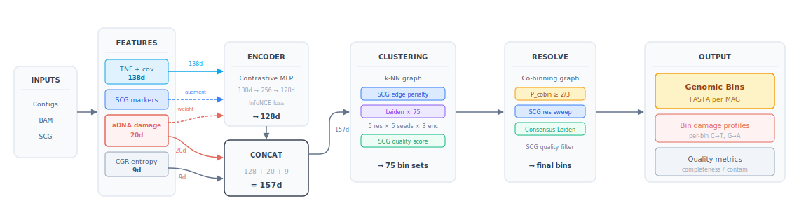

# AMBER — Ancient Metagenomic BinnER

[](LICENSE)
[](https://github.com/genomewalker/amber/releases/latest)
[](https://github.com/genomewalker/amber/actions/workflows/ci.yml)

AMBER bins metagenomic contigs from **ancient DNA (aDNA)** samples. Unlike general-purpose binners that treat all coverage signal as equally informative, AMBER models post-mortem DNA damage and fragment length degradation explicitly, learning contig embeddings that are robust to the mixed ancient/modern DNA signal common in paleogenomic assemblies.

---

## The problem: ancient DNA breaks metagenomic binning

Standard binners (MetaBAT2, SemiBin2, COMEBin) rely on two signals: **tetranucleotide frequency** (genomic composition) and **coverage depth** (co-abundance across samples). Both are distorted in ancient DNA:

1. **Damage-induced composition shift.** Post-mortem deamination converts cytosines to uracil (read as T) at fragment termini [Briggs et al. 2007]. C→T at 5′ and G→A at 3′ change the apparent tetranucleotide composition of every contig, pushing damaged and undamaged contigs of the *same genome* apart in composition space.

2. **Fragment length bias in coverage.** Ancient reads are short (~50–150 bp) while modern reads are longer (~150–300 bp). Short reads map more ambiguously and cover terminal regions of contigs differently, making coverage profiles systematically different between ancient and modern genomes even at equal abundance.

3. **Mixed ancient/modern populations.** Many paleogenomic assemblies contain reads from both ancient (damaged) DNA and modern (undamaged) DNA — from environmental contamination, recent organisms in the same sediment, or microbes that colonised the sample post-deposition. A binner unaware of this mixture conflates ancient and modern strains of the same species into a single bin, or splits a single ancient genome across multiple bins.

AMBER addresses all three by learning damage-aware embeddings and providing an EM-based deconvolution subcommand that separates ancient from modern reads before or after binning.

---

## How AMBER works

<p align="center">

</p>

### 1. Feature extraction

For each contig (minimum 2,500 bp), AMBER extracts a **157-dimensional feature vector**:

| Features | Dims | Description |
|----------|------|-------------|
| Encoder | 128 | SCG-supervised damage-aware InfoNCE (positive pairs = SCG co-members) |
| Damage profile | 10 | C→T rates at 5′ pos 1–5; G→A rates at 3′ pos 1–5 |
| Decay parameters | 2 | λ₅, λ₃ (exponential damage decay constants) |
| Fragment length | 2 | Mean and std dev of aligned read lengths |
| Damage coverage | 2 | Coverage ratio and effective N from damaged vs undamaged reads |
| Mismatch spectrum | 4 | T→C, A→G and other mismatch rates |
| CGR entropy | 9 | Multi-scale chaos game representation entropy/occupancy slopes |

See [[aDNA Features]] for the full mathematical derivation of each dimension.

### 2. SCG-supervised damage-aware contrastive learning

AMBER trains a contig encoder with a **supervised InfoNCE** loss where positive pairs are defined by **single-copy marker gene (SCG) co-membership**, not merely by substring augmentation. For each contig *i*, the positive set is:

$$P(i) = \{\text{augmented views of } i\} \cup \{j : \text{SCG}(j) = \text{SCG}(i) \neq \emptyset\}$$

Contigs confirmed by HMM profile search to carry the same single-copy marker belong to the same genome by definition; they are pulled together as positives. Contigs sharing *any* SCG with *i* are excluded from the denominator entirely (they are neither positive nor negative — they are masked out).

AMBER extends COMEBin's self-supervised InfoNCE with two changes: (1) positive pairs are defined by **SCG co-membership** instead of random augmentation pairs, providing genome-aware supervision directly from the HMM scan at no extra cost; (2) negatives are **downweighted by damage compatibility** *w_ij*, preventing the encoder from using damage state as a discriminative feature and thereby keeping ancient and modern strains of the same genome together.

Six augmented views per contig are generated (3 coverage-subsampling levels × 2 feature-noise intensities) and all pass through the shared MLP encoder (138→512→256→128, BatchNorm+ReLU, L2-normalised output).

The combined loss is:

$$\mathcal{L} = -\frac{1}{|B|} \sum_{i} \frac{1}{|P(i)|} \sum_{j \in P(i)} \log \frac{\exp(\text{sim}(z_i, z_j)/\tau)}{\sum_{k \notin \text{excl}(i)} w_{ik} \cdot \exp(\text{sim}(z_i, z_k)/\tau)}$$

where excl(*i*) = {*k* : M(*i*) ∩ M(*k*) ≠ ∅} masks out any contig sharing a marker with *i*, and *w_ik* is the **damage-aware negative weight**:

$$w_{ik} = 1 - \lambda_{\text{att}} \cdot c_i c_k \cdot (1 - f_{\text{compat}}(i, k))$$

*c_i = n_{eff,i} / (n_{eff,i} + n_0)* is confidence from effective read depth; *f*_compat is a symmetric damage compatibility score (terminal C→T rates + p_ancient agreement). Negatives with incompatible damage signatures (*w* < 1) are downweighted, preventing the encoder from using damage state as a discriminative feature.

Three independent encoder restarts (different random seeds) produce three kNN graphs; their edge weights are averaged into a consensus graph before Leiden.

### 3. Quality-guided Leiden clustering

After encoding, AMBER builds a **kNN graph** (HNSW approximate nearest neighbours) and clusters it with Leiden [Traag et al. 2019] using a three-phase quality refinement:

- **Phase 1 — SCG-guided Leiden.** Edges between contigs sharing single-copy marker genes (SCGs) are penalised before clustering: *w′ = w · exp(−3 · n_shared_markers)*. This pre-separates contigs from different genomes that happen to have similar embeddings.

- **Phase 2 — Contamination splitting.** Bins with excess SCG duplication (*dup_excess* > 0) are re-clustered at 3× resolution on their subgraph and split if total duplication decreases.

- **Phase 3 — Near-HQ rescue.** Bins at 75–90% estimated completeness recruit kNN neighbours that carry missing SCG markers, accepting a contig only if none of its markers are already in the target bin (no duplication risk).

Resolution is swept over [0.5, 5.0] with 25 random seeds; the configuration maximising a composite SCG quality score (strict-HQ > pre-HQ > MQ > completeness) is retained.

### 4. Partition consensus and `amber resolve`

Multiple independent AMBER runs (different encoder and Leiden seeds) are aggregated by `amber resolve` into a consensus binning. For each contig pair (*i*, *j*), a **co-binning affinity** is computed:

$$p_{\text{cobin}}(i,j) = \frac{|\{r : b_r(i) = b_r(j)\}|}{\min(R_i,\, R_j)}$$

where *R_i* is the number of runs in which contig *i* received any bin assignment. Leiden is re-run on this affinity graph with the same SCG-guided quality sweep, producing a consensus more stable than any individual run. With 3 runs, the reliable 10-bin core is recovered; with ≥ 5 runs, borderline bins accumulate sufficient evidence to enter the consensus.

---

## Installation

### Requirements

- C++17 compiler (GCC 9+)
- CMake ≥ 3.18
- HTSlib ≥ 1.15
- Eigen3
- OpenMP

All dependencies are available via conda:

```bash
conda env create -f environment.yml
conda activate amber
```

### Build (no GPU — works anywhere)

```bash
git clone https://github.com/genomewalker/amber.git
cd amber
mkdir build && cd build
cmake -DCMAKE_BUILD_TYPE=Release ..
cmake --build . --parallel
```

All subcommands work **except `amber bin`**, which requires LibTorch for neural network training.

### Enabling `amber bin` — CPU (no GPU required)

```bash
conda install pytorch cpuonly -c pytorch
cmake -DAMBER_USE_TORCH=ON -DCMAKE_PREFIX_PATH=$CONDA_PREFIX -DCMAKE_BUILD_TYPE=Release ..
cmake --build . --parallel
```

CPU training is ~5–10× slower than GPU but produces identical results.

### Enabling `amber bin` — GPU (CUDA 12)

```bash
conda install pytorch pytorch-cuda=12.1 -c pytorch -c nvidia
cmake -DAMBER_USE_TORCH=ON -DCMAKE_PREFIX_PATH=$CONDA_PREFIX -DCMAKE_BUILD_TYPE=Release ..
cmake --build . --parallel
```

> **Note:** GPU builds must be compiled on a node with CUDA libraries available.

### Install system-wide

```bash
cmake --install build --prefix /usr/local
```

---

## Quick start

### Minimum input

- Contigs FASTA (assembled metagenome, e.g. from MEGAHIT or metaSPAdes)
- BAM file (reads mapped to contigs, indexed)
- HMM marker file (`auxiliary/bacar_marker.hmm`, included in repo)

### Binning (3 restarts, 25 Leiden seeds — recommended)

```bash
amber bin \
    --contigs contigs.fa \
    --bam alignments.bam \
    --hmm auxiliary/bacar_marker.hmm \
    --encoder-seed 42 \
    --random-seed 1006 \
    --resolution 5.0 \
    --bandwidth 0.2 \
    --partgraph-ratio 50 \
    --encoder-restarts 3 \
    --leiden-restarts 25 \
    --threads 16 \
    --output bins/
```

### Aggregate 3 replicate runs

```bash
amber resolve \
    --runs run1/run.abin run2/run.abin run3/run.abin \
    --output consensus_bins/ \
    --threads 16
```

### Separate ancient from modern reads

```bash
amber deconvolve \
    --contigs reference.fa \
    --bam alignments.bam \
    --output deconvolve/ \
    --threads 16
```

### Per-bin damage statistics (post-hoc)

```bash
amber damage \
    --bam alignments.bam \
    --bins bins/ \
    --output damage_stats.tsv \
    --threads 16
```

---

## Subcommands

| Command | Description |
|---------|-------------|
| `amber bin` | Bin contigs with damage-aware contrastive learning *(requires LibTorch)* |
| `amber resolve` | Consensus binning from multiple independent runs |
| `amber deconvolve` | Separate ancient and modern DNA via EM on damage + fragment length |
| `amber damage` | Compute per-bin aDNA damage statistics from BAM |
| `amber seeds` | Generate SCG marker seeds for binning |

For subcommand help: `amber <command> --help`

See [[Command Reference]] for all flags.

---

## Key parameters for `amber bin`

| Parameter | Default | Description |
|-----------|---------|-------------|
| `--encoder-seed` | 42 | Random seed for neural network training |
| `--random-seed` | 1006 | Random seed for Leiden clustering |
| `--resolution` | 5.0 | Leiden resolution parameter (higher = more, smaller bins) |
| `--bandwidth` | 0.2 | kNN edge kernel bandwidth |
| `--partgraph-ratio` | 50 | Partition graph density ratio |
| `--encoder-restarts` | 3 | Independent encoder training restarts for consensus kNN |
| `--leiden-restarts` | 25 | Leiden random seed restarts per resolution |
| `--epochs` | 100 | Training epochs |
| `--threads` | 1 | CPU threads |
| `--min-length` | 2500 | Minimum contig length (bp) |
| `--damage-infonce` | on | Enable damage-aware InfoNCE negative weighting |

**Best validated configuration** (KapK sediment data, 11 HQ bins reproducible):

```
--encoder-seed 42 --random-seed 1006 --resolution 5.0 --bandwidth 0.2 --partgraph-ratio 50
```

---

## EM deconvolution (`amber deconvolve`)

AMBER models each read as arising from one of two populations — **ancient** (high terminal damage, short fragment) or **modern** (low damage, longer fragment) — using an EM algorithm:

**E-step:** For each read *r* and reference contig *c*, compute soft assignment:

$$p_{\text{ancient}}(r) = \frac{\pi_a \cdot P(\text{damage}_r \mid \text{ancient}) \cdot P(l_r \mid \text{ancient})}{\pi_a \cdot P(\cdot \mid \text{ancient}) + \pi_m \cdot P(\cdot \mid \text{modern})}$$

The damage likelihood is a product over terminal C→T and G→A positions using the exponential damage model *δ(p) = d · e^{−λp}*. The length likelihood uses fitted log-normal distributions for fragment lengths.

**M-step:** Update mixture fraction π and distribution parameters from soft counts.

Outputs two consensus FASTA sequences (ancient and modern) called against the reference, plus a per-position uncertainty file and optional BAM of modern-classified reads.

See [[Methods and Model]] for the full derivation.

---

## Output files

| File | Description |
|------|-------------|
| `bins/bin.*.fa` | One FASTA per bin |
| `bins/amber_summary.tsv` | Bin-level statistics (size, SCG completeness, contamination) |
| `bins/damage_per_bin.tsv` | Per-bin damage profile (C→T, G→A, λ, p_ancient) |
| `run.abin` | Binary run archive for `amber resolve` |
| `deconvolve/ancient_consensus.fa` | Ancient-population consensus FASTA |
| `deconvolve/modern_consensus.fa` | Modern-population consensus FASTA |
| `deconvolve/deconv_uncertainty.tsv` | Per-position posterior uncertainty |

See [[Output Formats]] for schema details.

---

## Validation

Use [CheckM2](https://github.com/chklovski/CheckM2) to assess bin quality:

```bash
checkm2 predict -i bins/ -o bins/checkm2 -x fa --threads 16
awk -F'\t' 'NR>1 && $2>=90 && $3<5' bins/checkm2/quality_report.tsv | wc -l  # HQ count
```

A high-quality (HQ) bin has ≥90% completeness and <5% contamination [MIMAG standard, Bowers et al. 2017].

---

## Citation

> Fernandez-Guerra A, Wörmer L, Borrel G et al. (2025) Two-million-year-old microbial communities from the Kap København Formation in North Greenland. *bioRxiv* doi: [10.1101/2023.06.10.544454](https://doi.org/10.1101/2023.06.10.544454)

```bibtex
@article{fernandezguerra2025,
  title={Two-million-year-old microbial communities from the {Kap K{\o}benhavn} Formation in North Greenland},
  author={Fernandez-Guerra, Antonio and W{\"o}rmer, Lars and Borrel, Guillaume and Delmont, Tom O and Elberling, Bo and Elvert, Marcus and Eren, A Murat and Gribaldo, Simonetta and Henriksen, Rasmus Amund and Hinrichs, Kai-Uwe and Jochheim, Annika and Korneliussen, Thorfinn S and Krupovic, Mart and Larsen, Nicolaj K and Perez-Laso, Rafael and Pedersen, Mikkel Winther and Pedersen, Vivi K and Ruter, Anthony H and Sand, Karina K and Sikora, Martin and Steinegger, Martin and Veseli, Iva and Wang, Yucheng and Zhao, Lei and {\v{Z}}ure, Marina and Kj{\ae}r, Kurt H and Willerslev, Eske},
  journal={bioRxiv},
  year={2025},
  doi={10.1101/2023.06.10.544454}
}
```

---

## References

- Briggs AW et al. (2007) Patterns of damage in genomic DNA sequences from a Neandertal. *PNAS* 104:14616–21.
- Bowers RM et al. (2017) Minimum information about a single amplified genome (MISAG) and a metagenome-assembled genome (MIMAG) of bacteria and archaea. *Nature Biotechnology* 35:725–731.
- Oord A van den et al. (2018) Representation Learning with Contrastive Predictive Coding. *arXiv* 1807.03748.
- Traag VA et al. (2019) From Louvain to Leiden: guaranteeing well-connected communities. *Scientific Reports* 9:5233.
- Wang Z et al. (2023) COMEBin allows effective binning of metagenomic contigs using coverage multi-view encoder. *Nature Communications* 15:1119.

---

## License

MIT — see [LICENSE](LICENSE).
