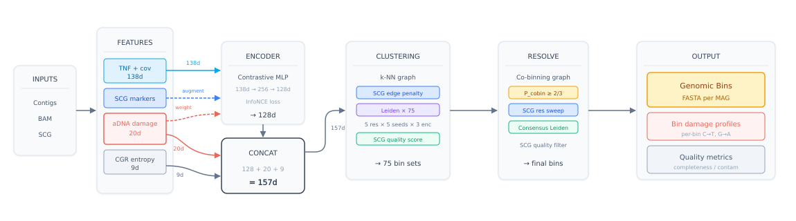

# AMBER — Ancient Metagenomic BinnER

[](LICENSE)
[](https://github.com/genomewalker/amber/releases/latest)
[](https://github.com/genomewalker/amber/actions/workflows/ci.yml)

AMBER bins metagenomic contigs from **ancient DNA (aDNA)** samples. Standard binners assume coverage and tetranucleotide frequency are clean signals — in aDNA they are not. AMBER models post-mortem damage and fragment length explicitly, so ancient and modern strains of the same genome end up in the same bin rather than scattered across several.

---

## The problem: ancient DNA breaks metagenomic binning

Standard binners (MetaBAT2 [1], SemiBin2 [2], COMEBin [3]) rely on two signals: **tetranucleotide frequency** (genomic composition) and **coverage depth** (co-abundance across samples). Both are distorted in ancient DNA:

1. **Damage-induced composition shift.** Post-mortem deamination converts cytosines to uracil (read as T) at fragment termini [4]. C→T substitutions accumulate at the 5′ end and G→A at the 3′ end, changing the apparent tetranucleotide composition of every contig. Damaged and undamaged copies of the *same genome* are pushed apart in composition space.

2. **Fragment length bias in coverage.** Ancient reads are short (median ~40–80 bp) while modern reads are longer (~150–300 bp). Short reads map more ambiguously and cover terminal regions of contigs differently, producing systematically different coverage profiles for ancient and modern genomes even at equal abundance [5].

3. **Mixed ancient/modern populations.** Paleogenomic assemblies often contain reads from both ancient (damaged) and modern (undamaged) DNA — from environmental contamination, recent colonising organisms, or in situ DNA turnover. A binner unaware of this mixture splits ancient and modern reads of the same taxon into separate bins, or merges them with wrong neighbours [6].

AMBER addresses all three: damage-aware embeddings prevent composition distortion from separating contigs of the same genome, and `amber deconvolve` separates ancient from modern reads via Bayesian EM when needed.

---

## How AMBER works

<p align="center">

</p>

### 1. Feature extraction

For each contig (minimum 1,001 bp by default), AMBER extracts a **157-dimensional feature vector** combining encoder output, aDNA-specific damage features, and multi-scale chaos game representation (CGR) features:

| Feature block | Dims | Description |
|---------------|------|-------------|
| Encoder output | 128 | SCG-guided damage-aware InfoNCE contrastive encoder |
| C→T damage profile | 5 | C→T substitution rates at 5′ positions 1–5 |
| G→A damage profile | 5 | G→A substitution rates at 3′ positions 1–5 |
| Decay parameters | 2 | λ₅, λ₃ — exponential damage decay constants fitted per contig |
| Fragment length | 2 | Mean and standard deviation of aligned read lengths |
| Damage coverage | 2 | Log-normalised read depth from ancient-classified (p > 0.6) and modern-classified (p < 0.4) reads |
| Mismatch spectrum | 4 | T→C at 5′, C→T at 3′, other mismatches at 5′, other mismatches at 3′ |
| CGR features | 9 | 6 cross-scale slopes (ΔH, ΔO, ΔL at 16→32 and 32→64 grid resolution) + absolute H₃₂, O₃₂, L₃₂ |

**aDNA damage features (20 dimensions).** The damage profile follows an exponential decay model, with terminal substitution rate at position *p* from the read end modelled as [7]:

$$\delta_p = d \cdot e^{-\lambda p}$$

where *d* is the damage amplitude and λ is the per-position decay constant. AMBER fits λ₅ and λ₃ independently for the 5′ and 3′ ends using the observed C→T and G→A rates at positions 1–5. Fragment length mean and standard deviation are computed from the aligned insert size distribution [5].

**CGR features (9 dimensions).** The chaos game representation [8] maps a nucleotide sequence onto the unit square by iterating toward one of four corner attractors (A, C, G, T). AMBER computes three metrics — Shannon entropy (H), occupancy (O, fraction of non-empty cells), and lacunarity (L, coefficient of variation of cell densities) — at grid resolutions 16×16, 32×32, and 64×64. The nine features are the three absolute values at 32×32 plus the six cross-scale slopes (Δmetric between adjacent resolutions), capturing sequence complexity across scales [9].

The encoder input is a 138-dimensional vector: 136 tetranucleotide frequencies (normalised, reverse-complement collapsed) + 2 coverage dimensions (log-normalised mean depth, coverage variance). The 20 aDNA and 9 CGR dimensions bypass the encoder and are concatenated directly to the 128-dimensional encoder output, forming the 157-dimensional clustering space.

### 2. SCG-guided damage-aware contrastive learning

AMBER trains a contig encoder using InfoNCE [10] (contrastive predictive coding), extended with two aDNA-specific modifications: SCG-guided hard negative mining and damage-aware negative down-weighting.

**Base encoder.** The architecture follows COMEBin [3]: a four-layer MLP (138→512→256→128) with BatchNorm and ReLU activations, with L2-normalised output embeddings. Six augmented views are generated per contig at training time — three coverage subsampling levels × two feature-noise intensities — matching the COMEBin augmentation protocol.

**Standard InfoNCE loss** [10] for a batch of *B* contigs with *V* views each:

$$\mathcal{L}_{\text{InfoNCE}} = -\frac{1}{BV} \sum_{i=1}^{BV} \log \frac{\exp(\text{sim}(z_i, z_{i^+})/\tau)}{\sum_{k \neq i} \exp(\text{sim}(z_i, z_k)/\tau)}$$

where *z_i* is the L2-normalised embedding of view *i*, *i*⁺ indexes the sibling views of the same contig, and τ is the temperature (default 0.1).

**Modification 1 — SCG hard negatives.** Single-copy marker genes (SCGs) are typically present exactly once per genome. Two contigs both containing the same SCG are therefore likely from *different* genomes — high-confidence (though not guaranteed) negative pairs. AMBER amplifies these pairs in the InfoNCE denominator by a factor `scg_boost` (default 2.0), providing stronger repulsion signal for contigs that compositional embeddings might otherwise conflate [3]:

$$w_{ij}^{\text{SCG}} = \begin{cases} \alpha_{\text{boost}} & \text{if } M(i) \cap M(j) \neq \emptyset \\ 1.0 & \text{otherwise} \end{cases}$$

where *M(i)* is the set of CheckM marker genes detected on contig *i* [11] and α_boost = 2.0.

**Modification 2 — Damage-aware negative down-weighting.** Ancient and modern strains of the same taxon carry identical genomic sequence but different damage states. Without correction, the encoder learns to separate them based on C→T and G→A patterns rather than genomic sequence — placing them in different bins. AMBER down-weights negatives that appear damage-incompatible, preventing damage state from becoming a discriminative feature:

$$w_{ij}^{\text{damage}} = 1 - \lambda_{\text{att}} \cdot c_i \cdot c_j \cdot (1 - f_{\text{compat}}(i, j))$$

where *c_i = n_{\text{eff},i} / (n_{\text{eff},i} + n_0)* is a read-depth confidence weight (low coverage → low confidence → weight approaches 1.0 regardless of damage), *f_compat(i, j)* is a symmetric damage compatibility score combining terminal C→T rates and p_ancient agreement, and λ_att controls attenuation strength.

The combined weight applied to each negative pair is:

$$w_{ij} = \max(w_{ij}^{\text{SCG}},\; w_{ij}^{\text{damage}})$$

so SCG hard negatives are always amplified regardless of damage similarity, while non-SCG pairs are modulated by damage compatibility alone.

**Consensus kNN.** Three independent encoder restarts (different random seeds) are trained on the same data. Each produces an HNSW approximate nearest-neighbour graph [12] (*k* = 10, cosine distance, 157-dim feature space). Edge weights from the three graphs are averaged into a single consensus graph before Leiden clustering, reducing sensitivity to training stochasticity.

**Marker gene database.** SCG detection uses the 206 universal bacterial and archaeal single-copy marker HMM profiles from CheckM [11], bundled as `auxiliary/checkm_markers_only.hmm`. HMM search is performed with HMMER3 hmmsearch.

### 3. Quality-guided Leiden clustering

AMBER clusters the consensus kNN graph using the Leiden algorithm [13] with a three-phase quality refinement driven by SCG-based completeness and contamination estimates.

**Phase 1 — SCG-guided Leiden.** Before each Leiden run, edges between contigs sharing any SCG marker are penalised:

$$w'_{ij} = w_{ij} \cdot e^{-\gamma \cdot n_{\text{shared}}}$$

with γ = 3.0 (default) and *n_shared* = |M(i) ∩ M(j)|. This pre-conditions the graph so that contigs from different genomes with similar embeddings are pushed apart before community detection runs.

The resolution parameter is swept over [0.5, 5.0] with 25 random Leiden seeds per resolution value. The configuration retained is the one that maximises a tiered quality score: strict-HQ bins (≥90% completeness, <5% contamination [14]) outrank pre-HQ bins (≥72% completeness, <5% contamination), which outrank MQ bins, which outrank raw completeness.

**Phase 2 — Contamination splitting.** After Phase 1, any bin with excess SCG duplication (*dup_excess* > 0, meaning more copies of any marker than expected) is re-clustered at 3× the Phase 1 resolution on its contig subgraph. The split is accepted if total *dup_excess* decreases across the resulting sub-bins.

**Phase 3 — Near-HQ rescue.** Bins estimated at 75–90% completeness are given one opportunity to recover missing SCG markers by recruiting kNN neighbours. A neighbouring contig is accepted into the target bin only if all of its SCG markers are absent from the current bin — ensuring no duplication is introduced.

### 4. Partition consensus and `amber resolve`

Multiple independent AMBER runs (different encoder and Leiden seeds) are aggregated by `amber resolve` into a consensus binning. For each contig pair (*i*, *j*), a **co-binning affinity** is computed:

$$p_{\text{cobin}}(i,j) = \frac{|\{r : b_r(i) = b_r(j)\}|}{\min(R_i,\, R_j)}$$

where *R_i* is the number of runs in which contig *i* received any bin assignment. Leiden is re-run on this affinity graph with the same SCG-guided quality sweep described above. With 3 runs, the reliable bin core is recovered reproducibly; with ≥ 5 runs, borderline bins accumulate sufficient co-binning evidence to appear in the consensus.

---

## Installation

### Requirements

- C++17 compiler (GCC 9+)
- CMake ≥ 3.18
- HTSlib ≥ 1.15
- Eigen3
- OpenMP
- HMMER3 (`hmmsearch` in PATH)

All dependencies are available via conda:

```bash
conda env create -f environment.yml
conda activate amber
```

### Build (no GPU — works anywhere)

```bash
git clone https://github.com/genomewalker/amber.git
cd amber
mkdir build && cd build
cmake -DCMAKE_BUILD_TYPE=Release ..
cmake --build . --parallel
```

All subcommands work **except `amber bin`**, which requires LibTorch for neural network training.

### Enabling `amber bin` — CPU (no GPU required)

```bash
conda install pytorch cpuonly -c pytorch
cmake -DAMBER_USE_TORCH=ON -DCMAKE_PREFIX_PATH=$CONDA_PREFIX -DCMAKE_BUILD_TYPE=Release ..
cmake --build . --parallel
```

CPU training is ~5–10× slower than GPU but produces identical results.

### Enabling `amber bin` — GPU (CUDA 12)

```bash
conda install pytorch pytorch-cuda=12.1 -c pytorch -c nvidia
cmake -DAMBER_USE_TORCH=ON -DCMAKE_PREFIX_PATH=$CONDA_PREFIX -DCMAKE_BUILD_TYPE=Release ..
cmake --build . --parallel
```

> **Note:** GPU builds must be compiled on a node with CUDA libraries available.

### Install system-wide

```bash
cmake --install build --prefix /usr/local
```

---

## Quick start

### Minimum input

- Contigs FASTA (assembled metagenome, e.g. from MEGAHIT or metaSPAdes)
- BAM file (reads mapped to contigs, sorted and indexed)
- `hmmsearch` available in PATH (from HMMER3)

The CheckM marker HMM (`auxiliary/checkm_markers_only.hmm`) is bundled with AMBER and located automatically. No `--hmm` flag is required.

### Binning (3 encoder restarts, 25 Leiden seeds — recommended)

```bash
amber bin \
    --contigs contigs.fa \
    --bam alignments.bam \
    --encoder-seed 42 \
    --random-seed 1006 \
    --resolution 5.0 \
    --bandwidth 0.2 \
    --partgraph-ratio 50 \
    --encoder-restarts 3 \
    --leiden-restarts 25 \
    --threads 16 \
    --output bins/
```

### Aggregate 3 replicate runs

```bash
amber resolve \
    --runs run1/run.abin run2/run.abin run3/run.abin \
    --output consensus_bins/ \
    --threads 16
```

### Separate ancient from modern reads

```bash
amber deconvolve \
    --contigs reference.fa \
    --bam alignments.bam \
    --output deconvolve/ \
    --threads 16
```

### Per-bin damage statistics (post-hoc)

```bash
amber damage \
    --bam alignments.bam \
    --bins bins/ \
    --output damage_stats.tsv \
    --threads 16
```

---

## Subcommands

| Command | Description |
|---------|-------------|
| `amber bin` | Bin contigs with damage-aware contrastive learning *(requires LibTorch)* |
| `amber resolve` | Consensus binning from multiple independent runs |
| `amber deconvolve` | Separate ancient and modern DNA via EM on damage + fragment length |
| `amber damage` | Compute per-bin aDNA damage statistics from BAM |
| `amber seeds` | Generate SCG marker seeds for binning |
| `amber chimera` | Detect chimeric contigs using multi-signal analysis |

For subcommand help: `amber <command> --help`

---

## Key parameters for `amber bin`

| Parameter | Default | Description |
|-----------|---------|-------------|
| `--encoder-seed` | 42 | Random seed for neural network training |
| `--random-seed` | 1006 | Random seed for Leiden clustering |
| `--resolution` | 5.0 | Leiden resolution parameter (higher = more, smaller bins) |
| `--bandwidth` | 0.2 | kNN edge kernel bandwidth |
| `--partgraph-ratio` | 50 | Partition graph density ratio |
| `--encoder-restarts` | 3 | Independent encoder training restarts for consensus kNN |
| `--leiden-restarts` | 25 | Leiden random seed restarts per resolution |
| `--epochs` | 100 | Training epochs |
| `--threads` | 1 | CPU threads |
| `--min-length` | 1001 | Minimum contig length (bp) |
| `--no-damage-infonce` | — | Disable damage-aware negative down-weighting |
| `--no-scg-infonce` | — | Disable SCG hard negative mining |

**Best validated configuration** (KapK sediment data, 11 HQ bins reproducible across 3 runs):

```
--encoder-seed 42 --random-seed 1006 --resolution 5.0 --bandwidth 0.2 --partgraph-ratio 50
```

---

## EM deconvolution (`amber deconvolve`)

AMBER models each read as arising from one of two populations — **ancient** (high terminal damage, short fragment) or **modern** (low damage, longer fragment) — using an EM algorithm [15].

**E-step.** For each read *r*, compute the posterior probability of ancient origin:

$$p_{\text{ancient}}(r) = \frac{\pi_a \cdot P(D_r \mid \text{ancient}) \cdot P(l_r \mid \text{ancient})}{\pi_a \cdot P(D_r \mid \text{ancient}) \cdot P(l_r \mid \text{ancient}) + \pi_m \cdot P(D_r \mid \text{modern}) \cdot P(l_r \mid \text{modern})}$$

The damage likelihood P(D_r | ancient) is computed as the product over terminal C→T and G→A observations using the exponential damage model δ(p) = d · e^{−λp} [7]. Fragment length likelihoods use log-normal distributions fitted independently to the ancient and modern populations.

**M-step.** Update the mixture fraction π_a and all distribution parameters (d, λ, length mode, length σ) from the soft read assignments.

The EM iterates until convergence or the maximum iteration limit. Outputs include two consensus FASTA sequences polished against the reference (ancient and modern), a per-position uncertainty file, and per-contig deconvolution statistics.

---

## Output files

| File | Description |
|------|-------------|
| `bins/bin.*.fa` | One FASTA per bin |
| `bins/amber_summary.tsv` | Bin-level statistics (size, SCG completeness, contamination, damage class) |
| `bins/damage_per_bin.tsv` | Per-bin damage profile (C→T, G→A, λ, p_ancient) |
| `run.abin` | Binary run archive for `amber resolve` |
| `deconvolve/ancient_consensus.fa` | Ancient-population consensus FASTA |
| `deconvolve/modern_consensus.fa` | Modern-population consensus FASTA |
| `deconvolve/deconvolution_stats.tsv` | Per-contig deconvolution statistics |
| `deconvolve/deconv_uncertainty.tsv` | Per-position posterior uncertainty |

---

## Validation

Use [CheckM2](https://github.com/chklovski/CheckM2) [16] to assess bin quality:

```bash
checkm2 predict -i bins/ -o bins/checkm2 -x fa --threads 16
awk -F'\t' 'NR>1 && $2>=90 && $3<5' bins/checkm2/quality_report.tsv | wc -l  # HQ count
```

A high-quality (HQ) bin has ≥90% completeness and <5% contamination per the MIMAG standard [14].

---

## Citation

> Fernandez-Guerra A, Wörmer L, Borrel G et al. (2025) Two-million-year-old microbial communities from the Kap København Formation in North Greenland. *bioRxiv* doi: [10.1101/2023.06.10.544454](https://doi.org/10.1101/2023.06.10.544454)

```bibtex
@article{fernandezguerra2025,
  title={Two-million-year-old microbial communities from the {Kap K{\o}benhavn} Formation in North Greenland},
  author={Fernandez-Guerra, Antonio and W{\"o}rmer, Lars and Borrel, Guillaume and others},
  journal={bioRxiv},
  year={2025},
  doi={10.1101/2023.06.10.544454}
}
```

---

## References

1. Kang DD et al. (2019) MetaBAT 2: an adaptive binning algorithm for robust and efficient genome reconstruction from metagenome assemblies. *PeerJ* 7:e7359.
2. Pan S et al. (2023) A deep siamese neural network improves metagenome-assembled genomes in microbiome datasets across different environments. *Nature Communications* 14:2899.
3. Wang Z et al. (2024) COMEBin allows effective binning of metagenomic contigs using coverage multi-view encoder. *Nature Communications* 15:1119.
4. Briggs AW et al. (2007) Patterns of damage in genomic DNA sequences from a Neandertal. *PNAS* 104:14616–21.
5. Jónsson H et al. (2013) mapDamage2.0: fast approximate Bayesian estimates of ancient DNA damage parameters. *Bioinformatics* 29:1682–84.
6. Sawyer S et al. (2012) Temporal patterns of nucleotide misincorporations and DNA fragmentation in ancient DNA. *PLOS ONE* 7:e34131.
7. Briggs AW et al. (2010) Removal of deaminated cytosines and detection of in vivo methylation in ancient DNA. *Nucleic Acids Research* 38:e87.
8. Jeffrey HJ (1990) Chaos game representation of gene structure. *Nucleic Acids Research* 18:2163–70.
9. Almeida JS et al. (2001) Analysis of genomic sequences by Chaos Game Representation. *Bioinformatics* 17:429–37.
10. van den Oord A et al. (2018) Representation learning with contrastive predictive coding. *arXiv* 1807.03748.
11. Parks DH et al. (2015) CheckM: assessing the quality of microbial genomes recovered from isolates, single cells, and metagenomes. *Genome Research* 25:1043–55.
12. Malkov YA, Yashunin DA (2020) Efficient and robust approximate nearest neighbor search using Hierarchical Navigable Small World graphs. *IEEE TPAMI* 42:824–36.
13. Traag VA et al. (2019) From Louvain to Leiden: guaranteeing well-connected communities. *Scientific Reports* 9:5233.
14. Bowers RM et al. (2017) Minimum information about a single amplified genome (MISAG) and a metagenome-assembled genome (MIMAG) of bacteria and archaea. *Nature Biotechnology* 35:725–31.
15. Dempster AP et al. (1977) Maximum likelihood from incomplete data via the EM algorithm. *Journal of the Royal Statistical Society: Series B* 39:1–38.
16. Chklovski A et al. (2023) CheckM2: a rapid, scalable and accurate tool for assessing microbial genome quality using machine learning. *Nature Methods* 20:1203–12.

---

## License

MIT — see [LICENSE](LICENSE).
